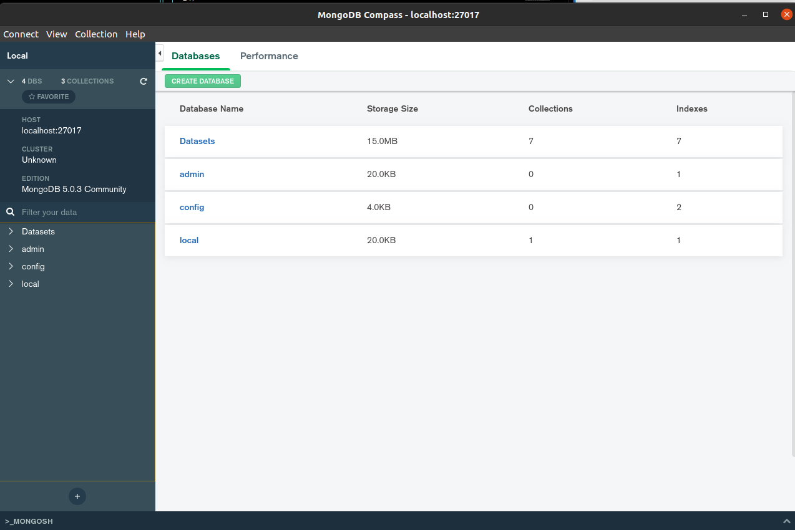

# Conhecendo uma imagem

As imagens podem ser oficiais ou não oficiais.

As imagens oficiais do docker são aquelas sem usuários em seus nomes. A imagem “ubuntu:16.04″ é oficial, por outro lado, a imagem “nuagebec/ubuntu” não é oficial. Essa segunda imagem é mantida pelo usuário nuagebec, que mantém outras imagens não oficiais.

As imagens oficiais são mantidas pela empresa docker e disponibilizadas na nuvem docker.

O objetivo das imagens oficiais é prover um ambiente básico (ex. debian, alpine, ruby, python), um ponto de partida para criação de imagens pelos usuários, como explicaremos mais adiante, ainda nesse capítulo.

As imagens não oficiais são mantidas pelos usuários que as criaram. Falaremos sobre envio de imagens para nuvem docker em outro tópico.

Nome da imagem

O nome de uma imagem oficial é composto por duas partes. A primeira, a documentação chama de “repositório” e, a segunda, é chamada de “tag”. No caso da imagem “ubuntu:14.04”, ubuntu é o repositório e 14.04 é a tag.

Para o docker, o “repositório” é uma abstração do conjunto de imagens. Não confunda com o local de armazenamento das imagens, que detalharemos mais adiante. Já a “tag”, é uma abstração para criar unidade dentro do conjunto de imagens definidas no “repositório”.

Um “repositório” pode conter mais de uma “tag” e cada conjunto repositório:tag representa uma imagem diferente.

Execute o comando abaixo para visualizar todas as imagens que se encontram localmente na sua estação, nesse momento:

```
docker image list

```

# Como criar uma imagem com Dockerfile

Quando se utiliza Dockerfile para gerar uma imagem, basicamente, é apresentada uma lista de instruções que serão aplicadas em determinada imagem para que outra imagem seja gerada com base nas modificações.


Podemos resumir que o arquivo Dockerfile, na verdade, representa a exata diferença entre uma determinada imagem, que aqui chamamos de base, e a imagem que se deseja criar. Nesse modelo temos total rastreabilidade sobre o que será modificado na nova imagem.

Voltemos ao exemplo da criação de uma imagem com mongodb com dados iniciais já populados no banco de dados.

Crie um arquivo chamado Dockerfile e dentro dele o seguinte conteúdo:

```
FROM ubuntu:20.04

```

Esse conteúdo identifica a imagem base que usaremos, no caso será o ubuntu na versão 20.04.

Nos próximos passos, usaremos alguns comandos, como:

FROM para informar qual imagem usaremos como base, nesse caso foi ubuntu:16.04.

RUN para informar quais comandos serão executados nesse ambiente para efetuar as mudanças necessárias na infraestrutura do sistema. São como comandos executados no shell do ambiente, igual ao modelo por commit, mas nesse caso foi efetuado automaticamente e, é completamente rastreável, já que esse Dockerfile será armazenado no sistema de controle de versão.

COPY é usado para copiar arquivos da estação onde está executando a construção para dentro da imagem. Usamos um arquivo de teste apenas para exemplificar essa possibilidade, mas essa instrução é muito utilizada para enviar arquivos de configuração de ambiente e códigos para serem executados em serviços de aplicação.

CMD para informar qual comando será executado por padrão, caso nenhum seja informado na inicialização de um container a partir dessa imagem. No exemplo, colocamos o comando bash, se essa imagem for usada para iniciar um container e não informamos o comando, ele executará o bash.

# Criando uma imagem personalizada do MongoDB

Criei uma Dockerfile nova e adicionar o seguinte conteúdo

```
FROM ubuntu:20.04

```

#### Instalando dependências

Agora, vamos instalar as dependências necessárias para executar os próximos comandos e baixar o pacote do mongodb

```
RUN apt-get update \
    && apt-get install -y \
    gnupg2 \
    ca-certificates

```

Feito isso, já podemos executar nossos comandos, agora vamos instalar o gosu, um pacote necessário para executarmos nosso entrypoint que nos ajudará a manipular configurações feitas ao iniciar o nosso container.

```
RUN set -eux; \
	apt-get update; \
	apt-get install -y gosu; \
	rm -rf /var/lib/apt/lists/*; \
	gosu nobody true

```

#### Configurando certificados

Tudo certo, até o momento só preparamos o ambiente para partirmos para a instação do mongodb, agora iremos baixar e armazenas os certificados do mongodb, eles são necessários para que posteriormente o utilizemo para baixar o mongodb do servidor.

O processo de instalação do MongoDb public GPG key é sempre genérico para todo packote que precisa de uma key para baixá-lo.
A key pode sempre ser encontrada sempre no site do http://keyserver.ubuntu.com, basta procurar pelo pacote@versão e encontrar uma chave válida.

Nesse caso, nossa pesquisa foi no http://keyserver.ubuntu.com/pks/lookup?search=mongodb&fingerprint=on&op=index

Ok, entendemos como funciona, agora é a hora de utilizar o comando que definirá essa key no nosso sistema base.

```
RUN apt-key adv --keyserver hkp://keyserver.ubuntu.com:80 --recv f5679a222c647c87527c2f8cb00a0bd1e2c63c11

```

O processo de instalação do mongodb já está pronto para iniciar pois instalamos todas dependências.

#### Definindo sources

Agora iremos adicionar o arquivo de sources no sistema, com ele definidio no sistema ao solicitar uma instalação do mongodb, o sistema saberá onde procurar os arquivos de instalação, para isso:

```
RUN echo "deb [ arch=amd64,arm64 ] https://repo.mongodb.org/apt/ubuntu focal/mongodb-org/5.0 multiverse" | tee /etc/apt/sources.list.d/mongodb-org-5.0.list

```

Feito isso, só precisamos instalar o pacote do mongodb

#### Instalando o MongoDb

Agora podemos instalar o pacote do mongodb, para isso utilizaremos o comando abaixo:

```
RUN apt-get update && apt-get install -y mongodb-org
```

Agora temos o mongoDB instalado, todavia precisamos configurar a inicialização dele.

#### Definindo a pasta de dados e volume

Para isso iremos criar novas pastas no sistema e definir um volume

```
RUN mkdir -p /data/db
VOLUME /data/db /data/configdb
```

Agora o mongodb já possui seus volumes e pasta de dados definidos.

#### Populando o banco de dados

Sempre que o container inicia com nosos serviço do mongodb, podemos já trazer o banco populado com os dados, para isso iremos criar uma pasta no mesmo local da Dockerfile para armazenar os csv que desejamos popular, nesse exemplo para fácil compreendimento utilizaremos csv pois já temos todas estruturas bem definidas, todavia poderiamos chamar o mongodb e inserir manualmente.

Criamos uma pasta chamada datasets, nessa pasta armazenamos alguns csv que gostariamos de que sejam populados no nosso banco de dados.

###### Criando o Script para popular

Agora é a hora de criar o script que irá popular nosso banco de dados, no caso do uso de csv, firá como abaixo:

```
#! /bin/sh
cd /usr/local/bin/datasets
datasets=`ls *.csv`
for eachfile in $datasets
do
   mongoimport -d Datasets -c "${eachfile%.csv}" --type csv --file $eachfile --headerline
done
```

O script abaixo pega todos os csv e utiliza o comando mongoimport para criar uma coleção para esse csv e importar todas linhas do csv para ela.

Todavia, até o momento só temos o script acessando a pasta datasets de um local estranho...
Isso acontece pois teremos que copiar nossos csvs e esse script de inciialização para dentro do sistema base, no nosso caso, o Ubuntu.

###### Copiando nossos Datasets e Script de populate para o sistema base

Agora é hora de voltar para a Dockerfile, em sua dockerfile, logo após a definição do volume, adicione o código abaixo:

```
COPY datasets /usr/local/bin/datasets
COPY init.sh /docker-entrypoint-initdb.d/
```

O primeiro comando COPY irá copiar nossa pasta dataset do projeto para dentro do sistema base, especificamente na pasta /usr/local/bin/, note que essa pasta é a mesma que importamos nossos datasets no script de populate.

Já o segundo comando COPY irá copiar nosso script de populate para dentro do sistema base, especificamente na pasta /docker-entrypoint-initdb.d/, essa pasta é uma padrão do docker, que ele utiliza para inicialização de banco de dados, basicamente tudo que tivermos ai, será executado com a intenção que será populato o banco de dados no momento da inicialização do container.

###### Criando um entrypoint

Um entrypoint é o comando principal de uma dockerfile, ele é o primeiro comando que será executando sempre que iniciar um container com essa imagem após toda a dockerfile ter sido executada.

Por que precisamos disso?
Muitas vezes, quando iniciamos nosso container, queremos realizar algumas verificações para garantir uma boa saúde do nosso container.

Nesse caso, utilizaremos o entrypoint indicado pela comunidade do mongodb.

Basicamente ele faz algumas verificações de users, caminhos configurados, exposes de portas.

Esse entrypoint é um script chamado docker-entrypoint.sh no nosso projeto.

Todavia, precisamos copiar esse script para o sistema base e definir como um entrypoint, para isso.

```
COPY docker-entrypoint.sh /usr/local/bin/
RUN chmod 777 /usr/local/bin/docker-entrypoint.sh \
    && ln -s /usr/local/bin/docker-entrypoint.sh /
ENTRYPOINT ["docker-entrypoint.sh"]
```

- O primeiro, o COPY, copia o script para o sistema base, especificamente na pasta /usr/local/bin.
- O segundo, o RUN, executa um comando dentro do sistema base, ele tem como objetivo, dar permissões elevadas para esse script, visto que esse script é nosso entrypoint e muitas vezes ele executa comandos sudos e precisa até mesmo dessa permissão para conseguir ser chamado no momento da inicialização do container.
- O terceiro, o ENTRYPOINT, define qual será o script que será considerado como entrypoint do container, no caso será o que estamos configurando, o docker-entrypoint.sh

#### Expondo o container em uma porta

Precisamos que esse container seja acessível por uma porta, nesse caso é um EXPOSE interno do docker apenas, isso não garante que será acessado pelo HOST por essa porta, para isso precisará definir no momento do run, qual porta do run corresponde a porta do container.

Para isso, usaremos a porta padrão do MongoDb, a 27017 com o comando EXPOSE

```
EXPOSE 27017
```

# Gerando nossa imagem após ter uma Dockerfile

Para constuir uma imagem nova baseada em uma Dockerfile existe, para ir no caminho que se encontra essa dockerfile e executar o comando abaixo no terminal:
\*Em alguns sistemas operacionais, será necessário o sudo.

```
docker build -t mongo-teste .
```

Esse comando, irá gerar uma imagem chamada mongo-teste, construida com base na nossa Dockerfile.

Após executar o comando, poderá executar o comando abaixo para verificar suas imagens disponíveis no docker.

```
docker image list

```

No nosso caso, temos a seguinte saida no terminal:

```
REPOSITORY    TAG       IMAGE ID       CREATED             SIZE
mongo-teste   latest    b820cc64a470   10 seconds ago   780MB
```

# Criando um container atráves de uma imagem disponível

Agora, temos nossa imagem disponível e podemos criar infinitos containers atráves dela, com isso vamos criar um container para demonstrar a disponibilização do container para o acesso de seu computador host.

Para isso, executa o comando abaixo:
\*Em alguns sistemas operacionais, será necessário o sudo.

```
docker run -p 27017:27017 -i -t mongo-teste --bind_ip_all
```

o docker run é um comando para criarmos novos containers, nele podemos passar alguns argumentos, nesse caso usamos:

- -p: usado para especificar qual porta do local host será mapeada com uma porta com expose no container, no nosso caso usamos o EXPOSE na porta 27017 e queremos que o computador host, externo a rede docker, o acesse por essa mesma porta.
- -t: especifica qual o nome da imagem que usaremos para criar esse container, nesse caso, no tópico anterior criamos a imagem mongo-test
- --bind_ip_all: Usamos esse comando para mapeadas todos os ips locais do host e deixar o container disponível para seu acesso.

Feito isso, comando executado, temos nosso mongodb sendo executado na porta 27017 do seu localhost.

# Acessando o MongoDb do container pelo seu Mongo Compass

Abra seu Compass e se conecte ao seu localhost na porta 27017, feito isso, terá acesso ao seu banco de dados, com sua coleção de Datasets já populadas.



# Gerando a imagem e executando o container de forma rápida usando o REPO

```
docker build -t mongo-teste .
docker run -p 27017:27017 -i -t mongo-teste --bind_ip_all
```

# Executando atráves do Docker Hub (Imagem Pronta com os Datasets fixos)

```
docker pull lfmaker/mongodb-for-datascience
docker run -p 27017:27017 -i -t lfmaker/mongodb-for-datascience --bind_ip_all
```
